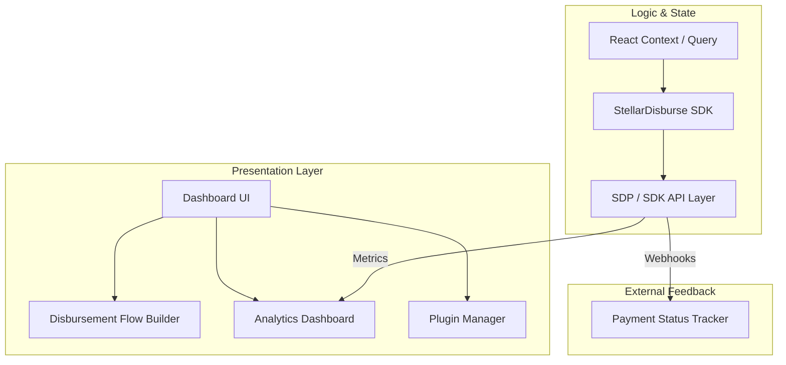

# StellarDisburse Portal: The Aid Operator Dashboard

[](https://www.drips.network/wave)
[](https://react.dev/)

**The high-fidelity management interface for the Stellar Disbursement Platform. Configure custom flows, monitor cross-rail payments, and visualize aid impact.**

---

# 🎨 Overview

`stellardisburse-portal` is the visual cockpit for the StellarDisburse ecosystem. Designed for aid operators and fintech leads, the portal provides a high-fidelity interface for managing complex disbursement batches, configuring compliance hooks, and monitoring payment status in real-time. It serves as the reference implementation for how organizations can extend the Stellar Disbursement Platform (SDP) with a custom, user-centric frontend.

### Key Capabilities:
*   **Disbursement Flow Builder:** A guided UI for configuring receivers, amounts, and conditional payment triggers.
*   **Analytics Dashboard:** High-fidelity data visualization for disbursement volume, success rates, and latency metrics.
*   **Plugin Management:** A visual interface for installing, reordering, and configuring compliance and KYC hooks.
*   **Payment Status Tracker:** Real-time visibility into the status of every receiver within a disbursement batch.

---

# 🏗️ Application Architecture

The portal is built as a modern React application, leveraging the StellarDisburse SDK for all backend orchestration.



---

# ✨ Core Features

| Feature | Technical Implementation | Ecosystem Value |
| :--- | :--- | :--- |
| **Flow Builder** | Interactive form with CSV upload support and dynamic contract linkage. | Empowers non-technical operators to manage complex aid deliveries. |
| **Analytics Suite** | Recharts-based visualization of metrics aggregated by the SDK analytics module. | Provides donor-ready reports on aid success and system performance. |
| **Plugin Manager** | A visual UI for managing the hook registry without requiring code changes. | Accelerates the deployment of new compliance requirements (e.g. KYC). |
| **Status Monitor** | Real-time table view showing payment status (Pending / Completed / Failed) per receiver. | Increases operational transparency and allows for rapid failure remediation. |

---

# 📂 Repository Structure

```text
stellardisburse-portal/
├── src/
│   ├── components/     # UI components (Charts, Forms, Status Tables)
│   ├── pages/          # Main views (Disbursement, Analytics, Plugins)
│   ├── hooks/          # UI state and SDK interaction hooks
│   ├── context/        # Global application and protocol state
│   └── styles/         # Tailwind CSS themes and humanitarian UI tokens
├── public/             # Static assets and icons
├── package.json        # Dependencies and scripts
└── README.md           # You are here
```

---

# 🛠️ Development & Contributing

We welcome contributions from Frontend developers and Product designers interested in social impact.

### Local Setup
1. **Clone the Repo:** `git clone https://github.com/stellardisburse/stellardisburse-portal.git`
2. **Install:** `npm install`
3. **Set Env:** Create a `.env` with relevant SDP and SDK endpoint IDs.
4. **Dev:** `npm run dev`

### Contributor Path (Wave 5)
*   **Frontend Developers:** Help us build the "Disbursement Flow Builder" and "Analytics Dashboard".
*   **UX Designers:** Optimize the dashboard for aid workers operating in low-bandwidth environments.
*   **Data Viz Enthusiasts:** Improve our chart suite for more granular success rate breakdown.
*   **Trivial Tasks:** Add shimmer skeletons to data tables and implement CSV export for reports.

---

# 📄 License

This project is licensed under the **Apache License 2.0**.
